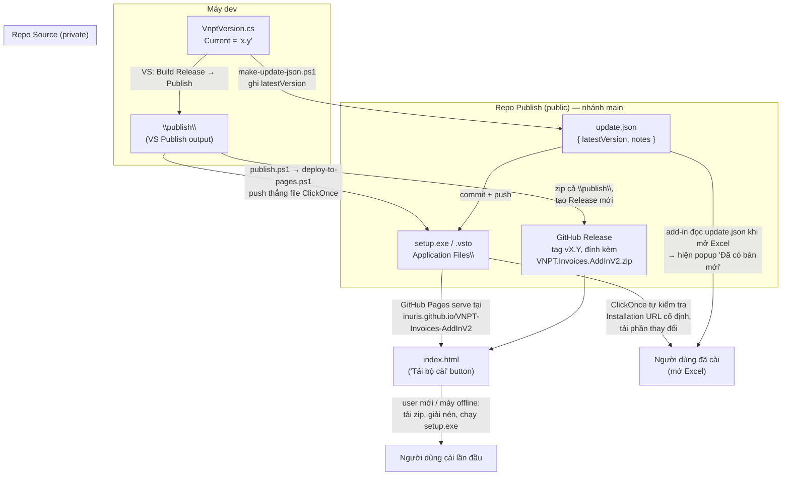

# Sơ đồ phát hành bản mới

Nguồn tham khảo: `RELEASE.md` và `docs/DEPLOY.md` trong repo Source. Sơ đồ này
cho thấy **2 cơ chế báo bản-mới khác nhau** chạy song song sau khi phát hành —
điểm hay bị nhầm là chỉ có một.

## Đọc sơ đồ này thế nào

- **Cột trái (DEV/SRC)**: chỗ duy nhất bump version — `VnptVersion.cs`. Mọi
  thứ khác (nhãn ribbon, `update.json`, so sánh bản khi kiểm tra cập nhật) đọc
  từ hằng số này, không sửa ở đâu khác.
- **3 nhánh ra khỏi `\publish\`**: file ClickOnce (đẩy thẳng bằng script),
  zip cho GitHub Release, và `update.json` (sinh riêng từ `make-update-json.ps1`,
  **không tự động đi kèm khi chạy `publish.ps1`** — phải commit tay).
- **2 đường tới người dùng đã cài** (`OLDUSER`) là **độc lập nhau**:
  - ClickOnce tự âm thầm tải phần đổi khi mở Excel — không cần `update.json`.
  - Popup "Đã có bản mới" trong add-in là do add-in tự đọc `update.json` —
    không phải ClickOnce. Quên bước commit `update.json` thì ClickOnce vẫn
    tự cập nhật bình thường, chỉ là không có popup báo trước.
- **Người dùng cài lần đầu / máy offline** đi qua nút "Tải bộ cài" → zip
  (Release asset), không đụng tới `update.json` hay cơ chế ClickOnce
  tự-kiểm-tra cho tới sau khi đã cài xong.
